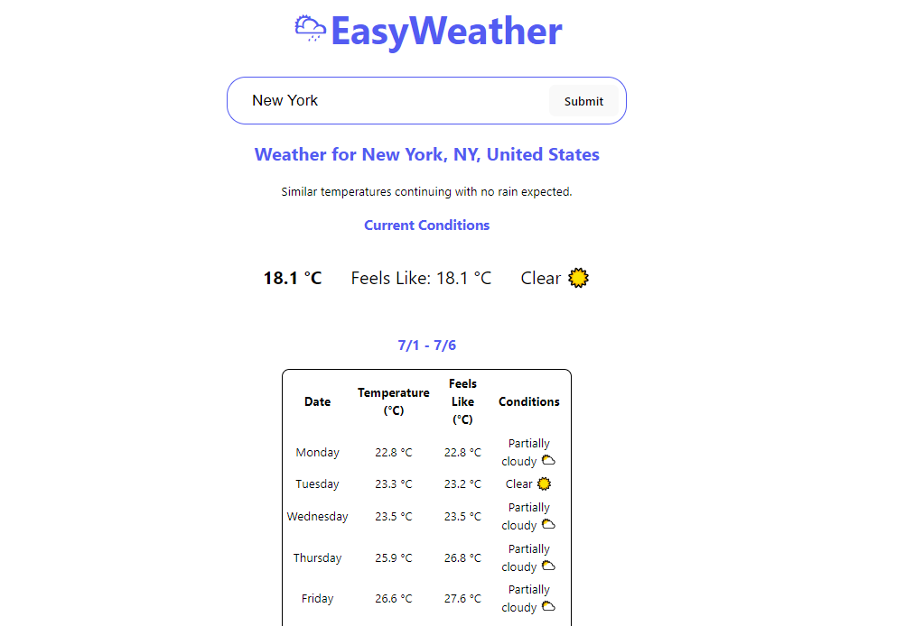

# EasyWeather Application

EasyWeather is a React-based weather application that fetches and displays weather data using the Visual Crossing Weather API. It provides current weather conditions, daily forecasts grouped by weeks, and weather alerts for a specified location.

## Features

- **Current Conditions:** Displays current temperature, feels like temperature, and weather conditions (e.g., Clear, Rain).
- **Daily Forecast:** Shows daily temperature, feels like temperature, and weather conditions for each day grouped by weeks.
- **Weather Alerts:** Provides any weather alerts issued for the location.
- **Caching:** Utilizes local storage to cache weather data for faster retrieval on subsequent visits.

## Technologies Used

- **React:** Frontend JavaScript library for building user interfaces.
- **Visual Crossing Weather API:** Provides weather data including current conditions, forecasts, and alerts.
- **localStorage:** Browser-based storage to cache weather data for improved performance.

## Getting Started

To run this project locally, follow these steps:

1. Clone this repository.
2. Install dependencies using `npm install`.
3. Create a `.env` file in the root directory and add your Visual Crossing API key: "VITE_API_KEY=**your_visual_crossing_api_key_here**"
4. 4. Start the development server: `npm start`.

## Folder Structure

The project structure is organized as follows:

- **`src/components/`**: Contains React components (`WeatherCard`, `WeatherForm`).
- **`src/pages/`**: Contains page components (`HomePage`).
- **`App.js`**: Main entry point of the application.
- **`App.css`**: Stylesheet for the application.
- **`readme.md`**: This file, providing information about the project.
### Caching Features

- **Local Storage Utilization**: The application utilizes browser `localStorage` to store fetched weather data locally.

- **Cached Data Retrieval**: Before making a new API call, the application checks `localStorage` for cached weather data using a specific cache key.

- **Cache Hit Handling**: If cached data exists (`cachedData`), it is parsed and displayed, reducing the need for a new API call.

- **Cache Refresh**: If no cached data is found or the cached data is outdated, the application fetches new data from the Visual Crossing Weather API and updates the cache with the latest data.

- **Performance Optimization**: By caching weather data locally, the application improves performance by minimizing API calls, enhancing user experience, and reducing server load.

## Contributing

Contributions are welcome! If you have suggestions, improvements, or feature requests, please open an issue or create a pull request.

